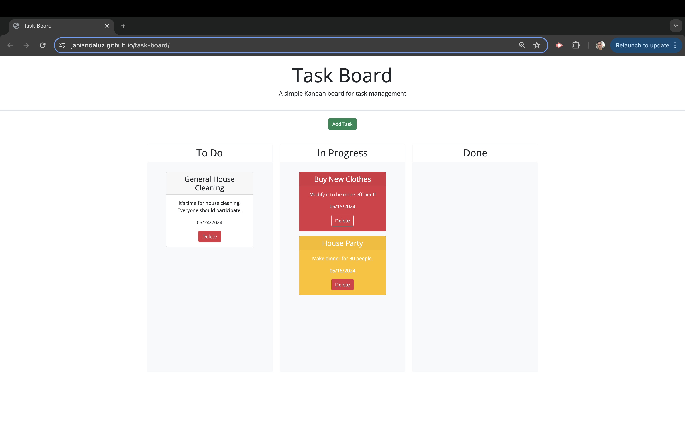

# 📋 Task Board

## 📝 Description
The Task Board is a web application designed to help project team members organize and track project tasks efficiently. With the Task Board, users can easily add, manage, and monitor the progress of individual project tasks, enhancing collaboration and productivity within the team.

## 🔧 Usage
To use the task board:

- Clone this repository to your local machine.
- Open index.html in a web browser.
- Use the task board to add, manage, and track project tasks.

[&rarr; This is the link to the website](https://janiandaluz.github.io/task-board/)

[&rarr; This is the link to the GitHub repository](https://github.com/janiandaluz/task-board)

## 💡 Key Features
1. Task Progress Visualization: The task board displays project tasks in columns representing different states of progress, including "Not Yet Started," "In Progress," and "Completed." This visual representation allows users to quickly assess the status of each task.
2. Deadline Indicators: Tasks are color-coded to indicate their proximity to the deadline. Tasks nearing the deadline are highlighted in yellow, while overdue tasks are highlighted in red, providing users with timely reminders to take action.
3. User-friendly Task Creation: Users can easily define new tasks by clicking on a button, which opens a modal dialog for entering the task title, description, and deadline date. This intuitive interface simplifies the task creation process.
4. Data Persistence: Task properties are saved locally using the browser's localStorage feature. This ensures that task data persists even after the user refreshes the page, allowing for seamless continuation of work.
5. Drag-and-Drop Functionality: Tasks can be easily moved between progress columns using drag-and-drop functionality. This feature enables users to update task progress with a simple gesture, streamlining task management.
6. Task Deletion: Users can delete tasks from the task board with a click of a button. Deleted tasks are permanently removed from the board and will not reappear upon refreshing the page.

## 🛠️ Technologies Used:
The Task Board is built using HTML, CSS, and JavaScript, with jQuery utilized for DOM manipulation. Data persistence is achieved using the browser's localStorage feature, ensuring that task data remains intact between sessions.

## 🤝 Contributions
Contributions are welcome! If you find any issues or have suggestions for improvements, please feel free to open an issue or create a pull request.

## 🎖️ Credits
- Credits given to fellow classmates, TAs, and instructor.
- Clone the starter code from canvas with the given link: [Code Refactor Starter Code](https://github.com/coding-boot-camp/musical-happiness)
- Credits to the following links:
    - [w3school for JAVA events](https://www.w3schools.com/js/js_events.asp)
    - [jQuery UI](https://jqueryui.com/droppable/)
    - [Bootstrap](https://getbootstrap.com/docs/4.3/components/modal/)
    - [day.js](https://day.js.org/en/)

## 🔒 License
This project is licensed under the MIT License.